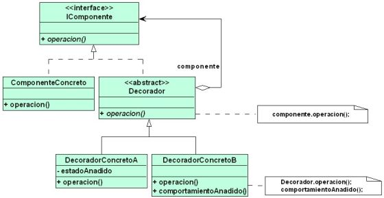

# Decoratorpattern
In object-oriented programming, the decorator pattern (also known as Wrapper, an alternative naming shared with the Adapter pattern) is a design pattern that allows behavior to be added to an individual object, either statically or dynamically, without affecting the behavior of other objects from the same class.[1] The decorator pattern is often useful for adhering to the Single Responsibility Principle, as it allows functionality to be divided between classes with unique areas of concern.

## Uml Diagram


## Uml Diagram Example


## Requirements
 ```$ npm install -g ts-node```

## Usage
Execute a script as you would normally with `node`. 

      ts-node main.ts   